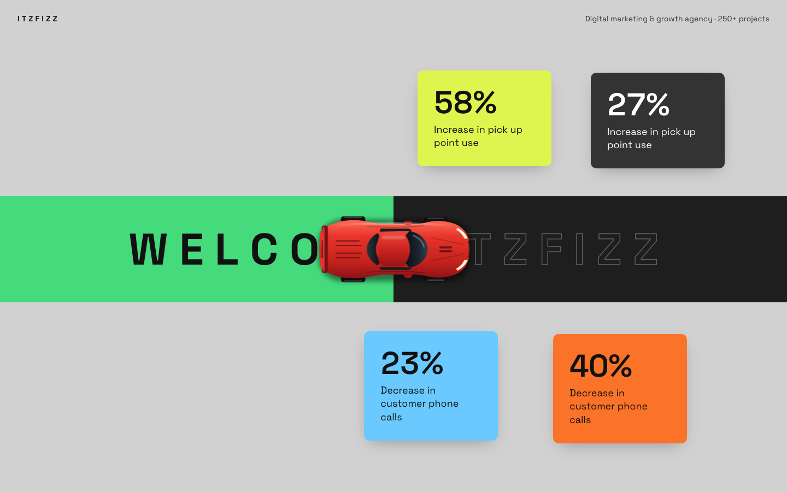
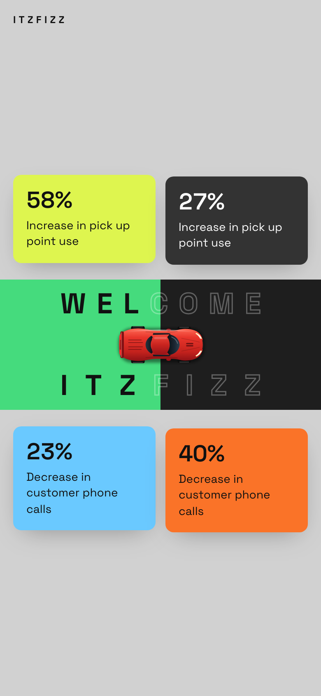

# Welcome Itzfizz: Scroll-Driven Hero Animation

A scroll-driven hero section where a car drives across the screen as you scroll, painting a green trail and revealing **W E L C O M E &nbsp; I T Z F I Z Z** letter by letter, with animated impact statistics around it.

Built as the Web Development Internship assignment for **Itzfizz Digital**.

- **Live demo:** https://iraagarg.github.io/itzfizz-hero-animation/
- **Repository:** https://github.com/iraagarg/itzfizz-hero-animation



<p align="center">
  
</p>

## Features

- **Load intro:** one GSAP timeline, about 2 seconds long.
  - The headline letters stagger in with a fade, rise and blur.
  - The car slides in from off-screen.
  - The four stat cards animate in one by one while their numbers count up from 0.
  - A "Scroll" hint appears.
- **Scroll-driven drive:** the hero is pinned while you scroll 1.5 screen heights.
  - The car's position is tied to scroll progress, not a timer.
  - A numeric `scrub` smooths the motion.
  - Lenis adds smooth scrolling on top.
- **Green trail:** follows the car exactly, using `scaleX` rather than `width`.
- **Letter reveal:** each letter turns from an outline to solid once the car has passed it, and reverses when you scroll back up.
- **Details that make it feel alive:** a slight steering tilt based on scroll speed, a small suspension bounce, and parallax on the stat cards.
- **Responsive:** tested at 360, 390, 768, 1024, 1280, 1440 and 1920 px wide.
  - On phones and tablets the headline wraps to two rows and the car drives between them.
  - The stat cards become a 2×2 grid.
  - There is never horizontal scrolling.
- **Accessible:**
  - The `h1` has an `aria-label`, and the decorative letter spans are `aria-hidden`.
  - The car image has alt text.
  - `prefers-reduced-motion` shows the finished scene with no animation or pinning.

## Tech stack

| | |
|---|---|
| Framework | Next.js 16 (App Router, static export), React 19, TypeScript |
| Styling | Tailwind CSS 4 |
| Animation | GSAP 3 + ScrollTrigger, `@gsap/react` (`useGSAP`) |
| Smooth scroll | Lenis, driven by GSAP's ticker |
| Font | Space Grotesk via `next/font` (self-hosted, no layout shift) |
| Hosting | GitHub Pages via GitHub Actions |

## How the animation works

All the animation code is in [`components/HeroSection.tsx`](components/HeroSection.tsx).

1. **Intro timeline.** A single `gsap.timeline()` runs when the component mounts and animates the headline, the car, the cards, the counters and the hint. CSS hides these elements until the timeline starts, so nothing flashes on load.
2. **Scroll timeline.** A second timeline is attached to a ScrollTrigger with `pin: true` and `scrub: 1`. It animates one number, `drive.p`, from 0 to 1. Because of the scrub, `drive.p` catches up to the scroll position over about a second, and that gives the motion its easing.
3. **Rendering from progress.** On every update, the car's x position and the trail's `scaleX` are worked out from `drive.p` and written with `gsap.quickSetter`. So each frame only changes `transform` values.
4. **Letter reveal.** The right edge of every letter is cached. When the car's center passes an edge, a short tween fades that letter from outline to solid. The tween only fires when the letter's state actually changes, and it runs in reverse when you scroll back.
5. **Stat cards.** They are inside the same scroll timeline, and each moves at its own parallax speed.

### Performance decisions

- **Only `transform` and `opacity` are animated.** The blur is the one exception, and it runs only during the intro.
- **No layout reads while scrolling.** Road width, car width and letter positions are measured once. They are measured again only on ScrollTrigger's `refresh` event, which covers resizing, rotating the device and fonts finishing loading. That event fires after pins have been re-applied at the new size, so the car, trail and letters always use one consistent set of measurements.
- **The layout can never overflow.** CSS custom properties size everything from the car's width (`--car-w`, `--headline-inset`, `--headline-size`), so the headline always fits in the part of the road the car doesn't cover at its start or end.
- **No duplicate animations.** Everything is created inside `useGSAP` and `gsap.matchMedia()`, so React Strict Mode double-mounts and hot reloads clean up properly.

## Project structure

```
app/
  layout.tsx              fonts, metadata, Open Graph
  page.tsx                page composition
  globals.css             Tailwind theme and hero sizing variables
components/
  HeroSection.tsx         hero markup, intro and scroll animations
  StatCard.tsx            one statistic card
  SmoothScroll.tsx        Lenis setup, synced with ScrollTrigger
  ClosingSection.tsx      section after the hero, plus footer
lib/
  gsap.ts                 registers GSAP plugins once
  stats.ts                stat card data
  assetPath.ts            adds the GitHub Pages basePath to /public assets
public/car.svg            hand-built top-down car illustration
.github/workflows/deploy.yml
```

## Run locally

Requires Node.js 20 or newer.

```bash
npm install
npm run dev        # http://localhost:3000
npm run lint
npm run build      # static export to ./out
```

## Deployment

Every push to `main` triggers the workflow in `.github/workflows/deploy.yml`. It lints the code, builds the site with `NEXT_PUBLIC_BASE_PATH=/itzfizz-hero-animation`, and publishes `./out` to GitHub Pages.

Three settings make the static export work on GitHub Pages:

- `output: "export"`, `trailingSlash: true` and `images.unoptimized` in [`next.config.ts`](next.config.ts).
- `basePath` and `assetPrefix` are read from the environment. They stay empty locally.
- Every file in `/public` is referenced through `assetPath()`, and `public/.nojekyll` stops GitHub Pages from ignoring the `_next/` folder.

## Credits

Inspired by the [car scroll animation reference](https://paraschaturvedi.github.io/car-scroll-animation) provided with the assignment. Car illustration drawn from scratch as an SVG.

Built by **Iraa Garg** ([github.com/iraagarg](https://github.com/iraagarg)).
